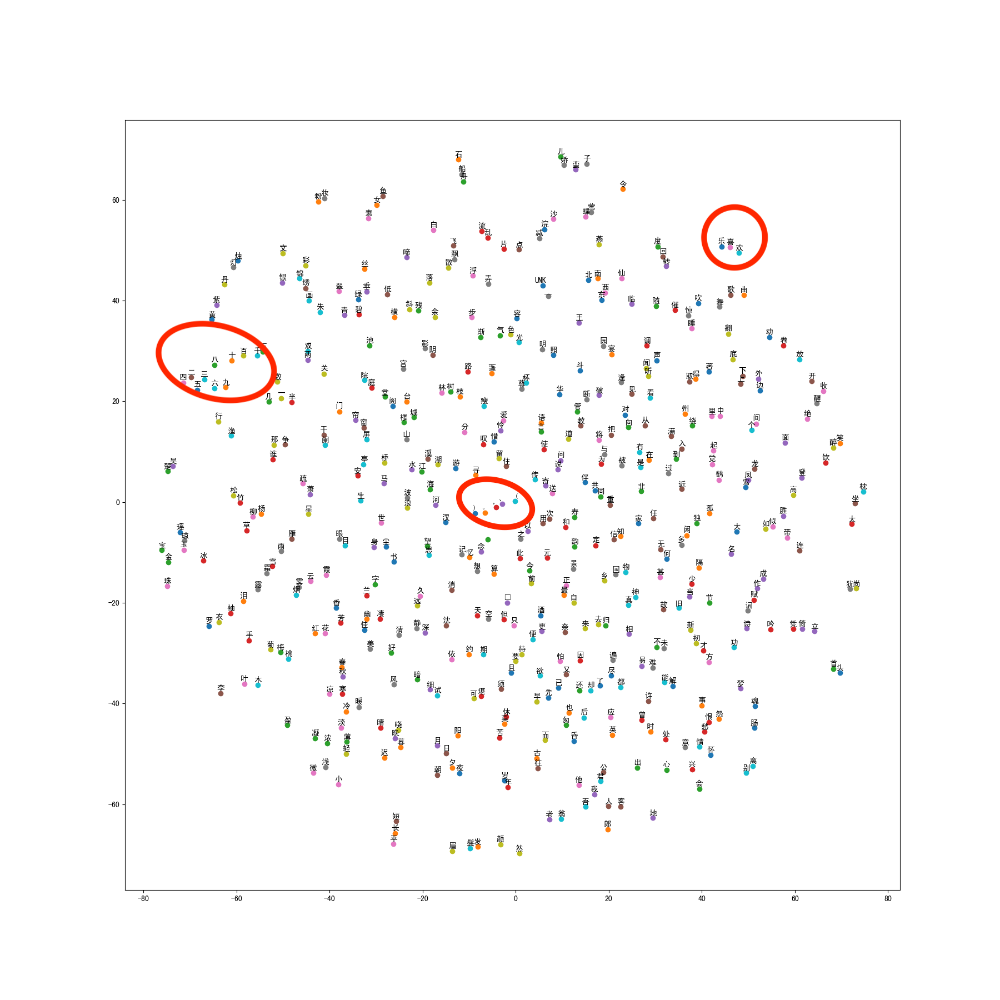

# 学习心得 -- 第十一周

## 第一部分 word embedding

Word embedding是一种对文字编码的技术。相对于普通的onehot编码，它使用维度更小的稠密向量来表示word。稠密向量的维度可以认为是word在context中的隐形特性，如果Vec（word1) - Vec (word2) = Vec（word3) - Vec (word4), 则word1，2之间的关系类似于word3，4之间的关系，dist[Vec（word1) - Vec (word2)]越小，表明word1和2之间关系更密切。

### 使用Word2Vec来生成emdedding：
1，统计学习文档中各word出现的频率，选择频率最高的5000个word生成字典，其他的词归类到UNK。
2，为了后期使用生成反查字典。
3，将用于训练的word在context中的前后文作为对应word的label。
4，设定embedding的大小为 [文档的大小, word的embedding特性数量]。
5，利用tf.nn.embedding_lookup得到训练结果，使用nce_loss作为损失函数。 
6，训练优化得到最后的embedding。
7，图形化。

### 结果分析
结果可以看出，左侧的数字聚集在一块， 中间标点符号聚集在一块，“乐，欢，喜”也具有比较明显的相似性。



## 第二部分 RNN

RNN的特点具有时间递归性，前一时刻的输出除了直接输出，还需要作为输入传到后一时刻。
LSTM RNN通过增加一个隐形态，可以认为是上一时刻的长期状态，然后使用这个长期状态、上一时刻的输出和当前时刻的输入来预测当前时刻的输出。LSTM中有多个门来控制上一时刻的长期状态、上一时刻的输出和当前时刻的输入的权重。

构建的RNN网络：
### define the lstm network
```
    #define the basic lstm cell
    basic_lstm = tf.nn.rnn_cell.BasicLSTMCell(self.dim_embedding, forget_bias=0, state_is_tuple=True)
            
    #add the Dropout Wrapper in the basic lstm cell
    basic_lstm = tf.nn.rnn_cell.DropoutWrapper(basic_lstm, output_keep_prob=self.keep_prob)
            
    #Use the basic cell to create a Multi RNN network with rnn_layers
    cell = tf.nn.rnn_cell.MultiRNNCell([basic_lstm]*self.rnn_layers, state_is_tuple=True)

    #Initial the initial_stae of the RNN network
    self.state_tensor = cell.zero_state(self.batch_size,dtype=tf.float32)
    #define the input and output
    seq_output, self.outputs_state_tensor = tf.nn.dynamic_rnn(cell, data, initial_state=self.state_tensor)
```
### Convert the output of the RNN network for loss cal
对seq_ouput进行处理，将其由[batchsize, step_num, embedding_size] 转成 [batchsize*step_num, embedding_size]。利用一个fc将再将output转成[num_words]与dictionary相同大小的矩阵。


### train: prepare the train data
因为RNN的时间相关性，需要将数据转成如下格式：
```
batch1:	 ch1.  |  ch2.   |  ch3.   ......
        d1_t-1 | d2_t-1  | d3_t-1
        d1_t   | d2_t    | d3_t
        d1_t+1 | d2_t+1  | d3_t+1
```

label 是train_data的后移一位。
利用word2vec中生成的字典，将文字转成onehot的编码。

设置每一次输入的init——state都是上一次state的输出。

### 结果
tinymind好像显示不出中文是code，因此model在tinymind上训练，sample是在本地调用tinymind的checkpoint进行输出的。
model地址：https://www.tinymind.com/chenxiuliang/quiz-w11-chenxiuliang
### 训练log


### sample 
结果还是可以看出来一点一点效果的。


